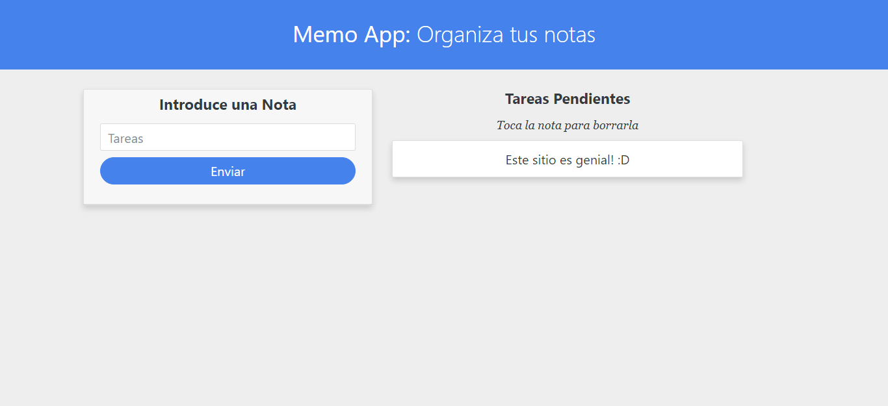

# Memo App

Una simple app de notas, para anotar tareas rápidas.

Tecnologías utilizadas: HTML, CSS, JavaScript, Git/Github, Bootstrap.

## Comenzando 🚀

Escriba notas las cuales quedarán guardadas en memoria (localStorage), luego de que las cumpla simplemente toquelas para borrarlas

## Despliegue 📦

Pueder ver la página en esta url: https://dbriceno10.github.io/memo-app/

